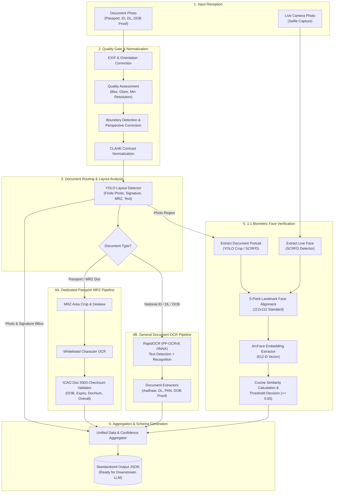
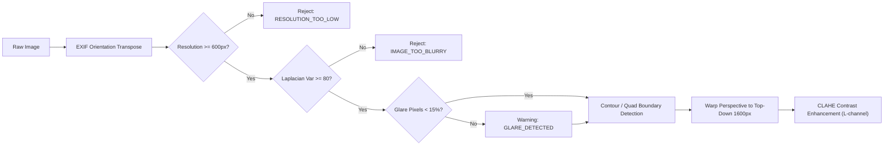
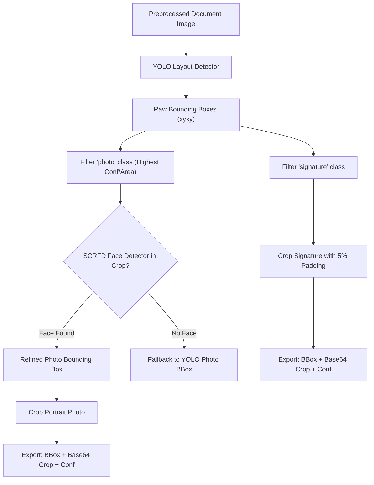
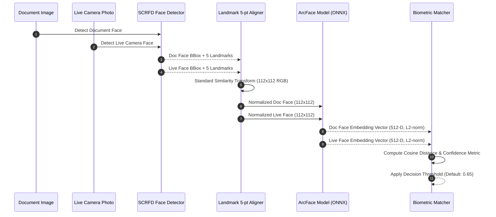

# Unified AI Pipeline Architecture for Identity Document Verification & Biometrics

**Document Version:** 1.0.0  
**Target System:** Automated Identity Verification & KYC API Service  
**Scope:** Architecture, Repository Audit, Model Selection, Data Flow, Coordinate Extraction, Biometric Verification, Schema Design & Failure Recovery  

---

## Table of Contents
1. [Executive Summary](#1-executive-summary)
2. [Repository Audit & Comparative Evaluation](#2-repository-audit--comparative-evaluation)
   - [2.1 `Passport-Verification-System-main`](#21-passport-verification-system-main)
   - [2.2 `PaddleOCR-main` vs. `document-ocr-main` (RapidOCR)](#22-paddleocr-main-vs-document-ocr-main-rapidocr)
   - [2.3 `MRZ_Passport_Reader_From_Image-main` vs. `document-ocr-main` MRZ Engine](#23-mrz_passport_reader_from_image-main-vs-document-ocr-main-mrz-engine)
   - [2.4 `insightface-master`](#24-insightface-master)
   - [2.5 Synthesis & Architectural Verdict](#25-synthesis--architectural-verdict)
3. [End-to-End Pipeline Architecture](#3-end-to-end-pipeline-architecture)
   - [3.1 High-Level Architecture Diagram](#31-high-level-architecture-diagram)
   - [3.2 Stage-by-Stage Processing Lifecycle](#32-stage-by-stage-processing-lifecycle)
4. [Specialized Sub-Pipelines](#4-specialized-sub-pipelines)
   - [4.1 Input Preprocessing & Image Quality Gates](#41-input-preprocessing--image-quality-gates)
   - [4.2 Dedicated Passport MRZ Extraction & Parsing](#42-dedicated-passport-mrz-extraction--parsing)
   - [4.3 General Document OCR (National ID, Driving License, DOB Proof)](#43-general-document-ocr-national-id-driving-license-dob-proof)
   - [4.4 Photo & Signature Coordinate Extraction](#44-photo--signature-coordinate-extraction)
   - [4.5 1:1 Biometric Face Verification Pipeline](#45-11-biometric-face-verification-pipeline)
5. [Output & Confidence Schema (LLM-Ready)](#5-output--confidence-schema-llm-ready)
   - [5.1 JSON Schema Specification](#51-json-schema-specification)
   - [5.2 Confidence Calculation & Scoring Mechanics](#52-confidence-calculation--scoring-mechanics)
6. [Edge Case & Failure Handling Matrix](#6-edge-case--failure-handling-matrix)
7. [System Integration & Recommended Folder Structure](#7-system-integration--recommended-folder-structure)

---

## 1. Executive Summary

This architecture defines an enterprise-grade, high-throughput AI document verification service capable of ingesting identity documents (**Passport**, **National ID**, **Driving License**, and **Date of Birth Proof**) alongside a **live camera capture photo**. 

The pipeline achieves five primary milestones:
1. **Strict Image Preprocessing & Quality Assurance:** Detects blur, glare, skews, perspective distortions, and low resolution prior to downstream inference.
2. **Dedicated Passport MRZ Pipeline:** Delivers high-precision detection, crop-level OCR, and strict ICAO Doc 9303 checksum validation for passports and machine-readable travel documents.
3. **General Document OCR:** Robust text detection, recognition, and polygon bounding-box extraction with word- and line-level confidence scores.
4. **Structural Artifact Extraction:** Locates bounding coordinates for document portrait photos and physical signatures using deep layout detection.
5. **1:1 Biometric Face Verification:** Compares the cropped document portrait with the live selfie using state-of-the-art deep facial alignment, 512-D ArcFace feature embeddings, and cosine similarity metric scoring.
6. **LLM Structured Output Readiness:** Standardizes all intermediate and final outputs into a deterministic, rich JSON structure formatted for downstream LLM parsing.

---

## 2. Repository Audit & Comparative Evaluation

A critical inspection of the reference repositories in the workspace was conducted to identify optimal algorithms, performance bottlenecks, and architectural trade-offs.

### 2.1 `Passport-Verification-System-main`
* **Core Technology:** PyTorch YOLO layout detection (`passport_layout.pt`, 22.5 MB), OpenCV geometric heuristics (`region_builder.py`), and EasyOCR (`ocr.py`).
* **Strengths:**
  - **Trained Layout Model:** The `passport_layout.pt` model detects document bounding boxes for `photo`, `signature`, and `mrz` regions directly.
  - **Dynamic Region Inference:** `region_builder.py` intelligently defines the textual block relative to the photo right-edge and MRZ top-edge.
* **Weaknesses:**
  - **EasyOCR Latency & CPU Overhead:** EasyOCR uses a heavy PyTorch CRAFT detector and ResNet recognition backbone, incurring 800ms–1500ms latency on CPU per crop.
  - **Rudimentary Regex Parsing:** The parser uses brittle substring heuristics rather than strict ICAO 9303 checksum validation.
* **Components to Borrow:**
  - YOLO layout detection weights and inference pipeline (`detector.py` and `region_builder.py`) for extracting photo and signature coordinates.

---

### 2.2 `PaddleOCR-main` vs. `document-ocr-main` (RapidOCR)

| Criterion | `PaddleOCR-main` (Full Framework) | `document-ocr-main` (RapidOCR / PP-OCRv5 ONNX) |
| :--- | :--- | :--- |
| **Engine Runtime** | Heavy `paddlepaddle` C++ / Python runtime (~800MB dependency). | Pure `onnxruntime` (CPU / CUDA / TensorRT compatible, ~40MB). |
| **Model Weights** | PP-OCRv4 / PP-Structure in native Paddle format. | PP-OCRv5 models converted to lightweight ONNX. |
| **Inference Latency** | 200–450ms (GPU), 600–1200ms (CPU). | 45–120ms (GPU), 110–250ms (CPU). |
| **Language Support** | 80+ languages via dynamic weights. | Multilingual fallback (English, Devanagari, Latin, Arabic, etc.). |
| **Deployment Fit** | Difficult in slim Docker containers; Python package conflicts. | Extremely portable, headless, microservice-friendly. |
| **Extraction Features** | Raw OCR, table recognition, layout parsing. | End-to-end KYC document pipelines, validators, and field extractors. |

* **Architectural Verdict:** **Adopt `document-ocr-main` with RapidOCR / ONNX Runtime.**  
  Full `PaddleOCR` brings massive dependency bloat without runtime accuracy advantages over ONNX-quantized PP-OCR models. `document-ocr-main` provides enterprise-grade input handling, EXIF correction, resolution checks, and battle-tested Indian & global KYC extractors (Aadhaar, DL, PAN, Passport).

---

### 2.3 `MRZ_Passport_Reader_From_Image-main` vs. `document-ocr-main` MRZ Engine

| Feature | `MRZ_Passport_Reader_From_Image-main` | `document-ocr-main` (`mrz_parser.py` + `travel_mrz.py`) |
| :--- | :--- | :--- |
| **MRZ Detection** | Custom TFLite segmentation network (`mrz_seg.tflite`). | Regex coordinate spatial clustering + YOLO layout crop. |
| **MRZ Formats** | TD3 (2x44 Passports) only. | TD1 (3x30 Cards/IDs), TD2 (2x36), TD3 (2x44 Passports), MRV-A/B Visas. |
| **OCR Technique** | EasyOCR on binary-thresholded crop. | PP-OCRv5 with character whitelist & digit confusion matrix correction. |
| **Check Digit Engine**| Basic string slicing. | Complete ICAO Doc 9303 weighted checksum ($7 \times, 3 \times, 1 \times$) for DOB, Expiry, Document Number, Personal Number, and Composite. |
| **Face Detection** | Obsolete Caffe Res10 SSD face model. | None (delegated to OCR/parsing). |

* **Architectural Verdict:** **Adopt `document-ocr-main`'s MRZ verification engine enhanced with YOLO spatial cropping.**  
  `MRZ_Passport_Reader_From_Image-main` relies on an outdated Caffe face detector and TFLite segmentation with EasyOCR. `document-ocr-main` provides full ICAO standard compliance across TD1, TD2, TD3, and MRV formats with character substitution tables (e.g., correcting `O` $\leftrightarrow$ `0`, `I` $\leftrightarrow$ `1`, `B` $\leftrightarrow$ `8` in numerical slots).

---

### 2.4 `insightface-master`
* **Core Technology:** SCRFD (Sample and Computation Redistribution for Efficient Face Detection) + ArcFace (ResNet/MobileFaceNet backbones with additive angular margin loss) + 5-point facial landmark alignment.
* **Evaluation:**
  - **State of the Art Accuracy:** NIST FRVT top-ranked face recognition embeddings ($>99.8\%$ on LFW, $>98.5\%$ on IJB-C).
  - **ONNX Runtime Native:** Seamless execution using ONNX Runtime with execution providers (`CPUExecutionProvider`, `CUDAExecutionProvider`).
  - **Robust Alignment:** Standard 5-point similarity transformation ($112 \times 112$ normalized crop) eliminates pose skews and lighting variations between document photos and live selfies.
* **Architectural Verdict:** **Adopt `insightface` as the unified biometric face verification engine.**

---

### 2.5 Synthesis & Architectural Verdict

```
┌─────────────────────────────────────────────────────────────────────────────────────────┐
│                                 UNIFIED AI ENGINE STACK                                 │
├───────────────────────────────┬───────────────────────────────┬─────────────────────────┤
│ Pipeline Component            │ Selected Engine / Source      │ Rationale               │
├───────────────────────────────┼───────────────────────────────┼─────────────────────────┤
│ Image Preprocessing & QA      │ `document-ocr-main`           │ Laplacian blur, HSV     │
│                               │ (OpenCV + PIL EXIF + CLAHE)   │ glare, perspective quad │
├───────────────────────────────┼───────────────────────────────┼─────────────────────────┤
│ Layout Detection              │ `passport-verfication`        │ YOLOv8/v11 Layout model │
│ (Photo & Signature Bounding)  │ (`passport_layout.pt`)        │ for document regions    │
├───────────────────────────────┼───────────────────────────────┼─────────────────────────┤
│ General OCR Engine            │ `document-ocr-main`           │ Lightweight, fast ONNX, │
│                               │ (RapidOCR / PP-OCRv5 ONNX)    │ word-level confidence   │
├───────────────────────────────┼───────────────────────────────┼─────────────────────────┤
│ Dedicated MRZ Pipeline        │ `document-ocr-main` +         │ TD1/TD2/TD3/MRV ICAO    │
│                               │ YOLO MRZ Cropper              │ 9303 checksum checks    │
├───────────────────────────────┼───────────────────────────────┼─────────────────────────┤
│ Biometric Verification (1:1)  │ `insightface`                 │ SCRFD Face Detection +  │
│                               │ (SCRFD + ArcFace ResNet-100)  │ ArcFace 512-D cosine sim│
└───────────────────────────────┴───────────────────────────────┴─────────────────────────┘
```

---

## 3. End-to-End Pipeline Architecture

### 3.1 High-Level Architecture Diagram



---

### 3.2 Stage-by-Stage Processing Lifecycle

1. **Intake & Validation:** Ingests document image bytes and live selfie bytes over an authenticated API request.
2. **Quality Gate:** Checks minimum resolution ($\ge 600\text{px}$ shortest side), blur (Laplacian variance $\ge 80$), and glare ($V > 250$ in HSV color space $< 15\%$). Rejects bad images early with clear diagnostics.
3. **Layout & Feature Localization:** Runs YOLO layout inference to isolate `photo`, `signature`, `mrz`, and `text` bounding boxes.
4. **Isolated Path Execution:**
   - **Passport Path:** Takes the segmented MRZ bounding box, applies specialized grayscale upscaling, runs character-whitelisted OCR, and computes standard check digits.
   - **General Document Path:** Passes the full perspective-corrected image to RapidOCR to yield high-density text tokens with polygon bounding coordinates.
5. **Biometric Face Verification:**
   - Detects the face in the cropped document portrait and the live photo via SCRFD.
   - Performs 5-point affine landmark alignment to a canonical $112 \times 112$ bounding box.
   - Extracts 512-dimensional normalized embeddings via ArcFace.
   - Computes cosine similarity:
     $$\text{Similarity}(E_{\text{doc}}, E_{\text{live}}) = \frac{E_{\text{doc}} \cdot E_{\text{live}}}{\|E_{\text{doc}}\| \|E_{\text{live}}\|}$$
6. **Data Normalization:** Packages bounding boxes, OCR tokens, check results, signature base64 crops, face crops, and confidence scores into the unified JSON payload.

---

## 4. Specialized Sub-Pipelines

### 4.1 Input Preprocessing & Image Quality Gates

The preprocessing pipeline inherits the strict verification rules from `document-ocr-main/core/preprocessor.py`:



* **Key Preprocessing Constants:**
  - `MIN_RESOLUTION`: $600\text{px}$
  - `BLUR_THRESHOLD`: $80.0$ (Laplacian variance of grayscale image)
  - `GLARE_V_THRESHOLD`: $250$ (HSV Value channel), max limit $15\%$ of frame
  - `TARGET_WIDTH`: $1600\text{px}$ (normalized for standard OCR coordinates)
  - `CLAHE`: `clipLimit=2.0`, `tileGridSize=(8, 8)` on the LAB color space L-channel.

---

### 4.2 Dedicated Passport MRZ Extraction & Parsing

Passports undergo a dual-track parsing strategy:
1. **Geometric/Model Crop:** The MRZ zone is isolated via YOLO layout detection (`passport_layout.pt`). If YOLO detection fails, fallback to bottom $25\%$ of the document frame.
2. **Character Substitution & Correction:** Pre-OCR upscaling (Cubic interpolation to height $\ge 300\text{px}$) followed by OCR character substitution tables specifically on numerical positions:

```python
# Digit correction mapping for strict numeric zones in MRZ
DIGIT_CORRECTIONS = {
    'O': '0', 'o': '0', 'D': '0', 'Q': '0',
    'I': '1', 'i': '1', 'l': '1', 'L': '1',
    'Z': '2', 'z': '2', 'A': '4', 'a': '4',
    'S': '5', 's': '5', 'G': '6', 'g': '6',
    'B': '8', 'b': '8'
}
```

3. **ICAO 9303 Checksum Engine:**
   - Multipliers: $[7, 3, 1]$ repeating.
   - Character map: $0\text{--}9 \rightarrow 0\text{--}9$, $A\text{--}Z \rightarrow 10\text{--}35$, $<$ $\rightarrow 0$.
   - Validates individual checksums for Document Number, Date of Birth, Expiration Date, Optional Data / Personal Number, and the Composite Checksum.

---

### 4.3 General Document OCR (National ID, Driving License, DOB Proof)

For non-passport documents (e.g., Aadhaar, Voter ID, PAN, Driving Licenses, Birth Certificates):
- **Detection & Recognition:** RapidOCR PP-OCRv5 ONNX model runs over the normalized image.
- **Bounding Boxes:** Each token returns quadrilateral coordinates $[[x_1, y_1], [x_2, y_2], [x_3, y_3], [x_4, y_4]]$ and a confidence score $\in [0.0, 1.0]$.
- **Field RegEx Engine:** Extracted tokens are scanned against document-specific regex patterns:
  - **Driving License:** State prefix (e.g., `DL-`, `MH`, `KA`), issue/expiry dates, vehicle classes (`LMV`, `MCWG`).
  - **National ID / Aadhaar:** 12-digit Verhoeff-validated strings, Father's Name regex, DOB patterns.
  - **Date of Birth Proofs:** Multi-format date extractors (`DD/MM/YYYY`, `YYYY-MM-DD`, `DD-Mon-YYYY`) with semantic keyword proximity matching (`"Date of Birth"`, `"DOB"`, `"Birth"`).

---

### 4.4 Photo & Signature Coordinate Extraction

Document security elements (photograph and physical signature) are extracted and cropped for downstream auditing:



1. **YOLO Detection:** Detects `photo` and `signature` classes.
2. **Face Refinement (Dual-Check):** The photo box is validated by running SCRFD face detection over the crop. If the face position is slightly misaligned, the bounding box expands/centers around the 5 facial landmarks with $20\%$ margin.
3. **Signature Isolation:** Signature box is cropped with a $5\%$ boundary pad and thresholded to check for valid stroke density (avoiding blank crops).

---

### 4.5 1:1 Biometric Face Verification Pipeline



#### Decision Thresholds & Risk Bands:
* **Match Confirmed ($\text{Score} \ge 0.70$):** High confidence match. Genuine verification.
* **Review Band ($0.55 \le \text{Score} < 0.70$):** Borderline similarity. Potential age difference, lighting variation, or lower quality document print. Flagged for manual review.
* **Match Rejected ($\text{Score} < 0.55$):** Impostor or incorrect document. Verification failed.

---

## 5. Output & Confidence Schema (LLM-Ready)

The output JSON provides structured, component-level, and token-level details. It is structured to be passed directly to a downstream LLM for final entity structuring.

### 5.1 JSON Schema Specification

```json
{
  "$schema": "https://json-schema.org/draft/2020-12/schema",
  "title": "IdentityVerificationPipelineOutput",
  "type": "object",
  "required": [
    "request_id",
    "timestamp",
    "document_metadata",
    "quality_assessment",
    "layout_coordinates",
    "extracted_data",
    "biometric_verification",
    "pipeline_summary"
  ],
  "properties": {
    "request_id": { "type": "string" },
    "timestamp": { "type": "string", "format": "date-time" },
    "document_metadata": {
      "type": "object",
      "properties": {
        "detected_type": { "type": "string", "enum": ["passport", "national_id", "driving_license", "dob_proof", "unknown"] },
        "document_country": { "type": ["string", "null"] },
        "orientation_applied_degrees": { "type": "integer" },
        "normalized_dimensions": {
          "type": "object",
          "properties": { "width": { "type": "integer" }, "height": { "type": "integer" } }
        }
      }
    },
    "quality_assessment": {
      "type": "object",
      "properties": {
        "passed": { "type": "boolean" },
        "blur_score": { "type": "number", "description": "Laplacian variance" },
        "glare_detected": { "type": "boolean" },
        "glare_ratio": { "type": "number" },
        "warnings": { "type": "array", "items": { "type": "string" } },
        "errors": { "type": "array", "items": { "type": "string" } }
      }
    },
    "layout_coordinates": {
      "type": "object",
      "properties": {
        "photo": {
          "type": "object",
          "properties": {
            "bounding_box": { "type": "array", "items": { "type": "integer" }, "minItems": 4, "maxItems": 4, "description": "[x1, y1, x2, y2]" },
            "confidence": { "type": "number" },
            "image_base64": { "type": ["string", "null"] }
          }
        },
        "signature": {
          "type": "object",
          "properties": {
            "bounding_box": { "type": "array", "items": { "type": "integer" }, "minItems": 4, "maxItems": 4 },
            "confidence": { "type": "number" },
            "image_base64": { "type": ["string", "null"] }
          }
        },
        "mrz_region": {
          "type": ["object", "null"],
          "properties": {
            "bounding_box": { "type": "array", "items": { "type": "integer" }, "minItems": 4, "maxItems": 4 },
            "confidence": { "type": "number" }
          }
        }
      }
    },
    "extracted_data": {
      "type": "object",
      "properties": {
        "mrz": {
          "type": ["object", "null"],
          "properties": {
            "is_valid_format": { "type": "boolean" },
            "mrz_type": { "type": "string", "enum": ["TD1", "TD2", "TD3", "MRV_A", "MRV_B"] },
            "raw_lines": { "type": "array", "items": { "type": "string" } },
            "fields": {
              "type": "object",
              "properties": {
                "document_number": { "type": "string" },
                "surname": { "type": "string" },
                "given_names": { "type": "string" },
                "nationality": { "type": "string" },
                "date_of_birth": { "type": "string" },
                "sex": { "type": "string" },
                "expiry_date": { "type": "string" },
                "personal_number": { "type": ["string", "null"] }
              }
            },
            "checksums": {
              "type": "object",
              "properties": {
                "document_number": { "type": "boolean" },
                "date_of_birth": { "type": "boolean" },
                "expiry_date": { "type": "boolean" },
                "personal_number": { "type": "boolean" },
                "composite": { "type": "boolean" },
                "all_valid": { "type": "boolean" }
              }
            },
            "confidence": { "type": "number" }
          }
        },
        "ocr_text_blocks": {
          "type": "array",
          "items": {
            "type": "object",
            "properties": {
              "text": { "type": "string" },
              "polygon": { "type": "array", "items": { "type": "array", "items": { "type": "integer" } } },
              "confidence": { "type": "number" }
            }
          }
        },
        "rule_extracted_fields": {
          "type": "object",
          "description": "Pre-parsed regex fields to assist downstream LLM",
          "additionalProperties": {
            "type": "object",
            "properties": {
              "value": { "type": ["string", "null"] },
              "confidence": { "type": "number" },
              "source_region_index": { "type": "integer" }
            }
          }
        }
      }
    },
    "biometric_verification": {
      "type": "object",
      "properties": {
        "status": { "type": "string", "enum": ["VERIFIED", "REVIEW_REQUIRED", "REJECTED", "FAILED"] },
        "match_score": { "type": "number", "description": "Cosine similarity score between 0.0 and 1.0" },
        "decision_threshold": { "type": "number" },
        "doc_face_detected": { "type": "boolean" },
        "doc_face_bbox": { "type": "array", "items": { "type": "integer" } },
        "live_face_detected": { "type": "boolean" },
        "live_face_bbox": { "type": "array", "items": { "type": "integer" } },
        "diagnostics": { "type": "array", "items": { "type": "string" } }
      }
    },
    "pipeline_summary": {
      "type": "object",
      "properties": {
        "overall_confidence": { "type": "number" },
        "ocr_confidence_mean": { "type": "number" },
        "layout_confidence_mean": { "type": "number" },
        "execution_time_ms": { "type": "number" }
      }
    }
  }
}
```

---

### 5.2 Confidence Calculation & Scoring Mechanics

To prevent arbitrary scoring, component confidences are explicitly defined:

1. **OCR Text Block Confidence ($C_{\text{ocr}}$):**
   $$C_{\text{ocr}} = \frac{1}{N} \sum_{i=1}^N c_i \quad \text{where } c_i \in [0.0, 1.0] \text{ from PP-OCRv5 softmax output}$$
2. **MRZ Confidence ($C_{\text{mrz}}$):**
   $$C_{\text{mrz}} = (0.4 \times C_{\text{mrz\_ocr}}) + (0.6 \times \text{ChecksumScore})$$
   $$\text{ChecksumScore} = \frac{\text{Valid Checksums Count}}{\text{Total Required Checksums}}$$
3. **Biometric Similarity Score ($S_{\text{bio}}$):**
   Normalized cosine similarity transformed to $[0.0, 1.0]$:
   $$S_{\text{bio}} = \max\left(0.0, \frac{\mathbf{u}_{\text{doc}} \cdot \mathbf{v}_{\text{live}}}{\|\mathbf{u}_{\text{doc}}\| \|\mathbf{v}_{\text{live}}\|}\right)$$
4. **Aggregate Pipeline Confidence Score ($C_{\text{final}}$):**
   $$C_{\text{final}} = w_1 C_{\text{qa}} + w_2 C_{\text{layout}} + w_3 C_{\text{mrz/ocr}} + w_4 S_{\text{bio}}$$
   *(Default Weights: $w_1 = 0.10$, $w_2 = 0.15$, $w_3 = 0.35$, $w_4 = 0.40$)*

---

## 6. Edge Case & Failure Handling Matrix

| Scenario / Defect | Detection Mechanism | Recovery / Pipeline Action | System Response Status |
| :--- | :--- | :--- | :--- |
| **Motion Blur / Defocus** | Laplacian variance $< 80.0$ | Reject early. Prevent wasted OCR/Biometric computation. | `400 Bad Request` (`IMAGE_TOO_BLURRY`) |
| **Harsh Glare / Flash** | HSV $V$-channel $> 250$ in $> 15\%$ image pixels | Apply adaptive CLAHE local tone mapping. Add `"GLARE_DETECTED"` warning. | Process with warning |
| **Skewed / Rotated Document** | `ImageOps.exif_transpose` + 4-point perspective contour | Warp quadrilateral perspective to flat rectangular plane. | Auto-corrected (`PERSPECTIVE_APPLIED`) |
| **90° / 180° / 270° Orientation** | Text angle direction classifier (PP-OCRv5 orientation model) | Rotate image by $90^\circ$, $180^\circ$, or $270^\circ$ and re-feed to detector. | Auto-corrected (`ROTATION_CORRECTED`) |
| **Missing Passport MRZ Checksum** | ICAO Doc 9303 checksum mismatch | Execute character replacement tables; if still invalid, flag field as `checksum_valid: false`. | Partial Success (`MRZ_CHECKSUM_FAILED`) |
| **No Face Found in Document Photo** | SCRFD detects 0 faces in doc crop | Fallback to full document frame face search. If none found, abort verification. | `200 OK` (`DOC_FACE_NOT_FOUND`, Biometrics Skipped) |
| **Multiple Faces in Live Selfie** | SCRFD detects $> 1$ face with confidence $> 0.5$ | Reject live photo to prevent spoofing or background bystander matching. | `400 Bad Request` (`MULTIPLE_FACES_IN_LIVE_PHOTO`) |
| **No Signature Region Found** | YOLO detects no signature bounding box | Set `signature: null` in output; document is processed normally (some IDs lack signatures). | `200 OK` (`SIGNATURE_NOT_PRESENT`) |
| **Degenerate Document Quad** | Warped area $< 50\%$ original frame area | Discard perspective transform and process unwarped raw frame. | Warning (`PERSPECTIVE_DISCARDED`) |

---

## 7. System Integration & Recommended Folder Structure

When implementation begins, the unified services will be organized cleanly inside the existing `ai-services/` directory:

```
ai-services/
├── core/
│   ├── config.py                 # Configuration parameters & thresholds
│   ├── exceptions.py             # Domain-specific exceptions
│   ├── logger.py                 # Structured JSON logger
│   └── pipeline.py               # Master Orchestrator Pipeline
├── preprocessing/
│   ├── quality.py                # Blur, glare, and resolution checks
│   ├── orient.py                 # EXIF & Angle orientation correction
│   └── perspective.py            # Quadrilateral contour warp & CLAHE
├── layout/
│   ├── detector.py               # YOLO Layout Model (Photo, Sig, MRZ, Text)
│   └── region_cropper.py         # Coordinate extraction & padding crops
├── ocr/
│   ├── engine.py                 # RapidOCR (PP-OCRv5 ONNX) Wrapper
│   ├── mrz/
│   │   ├── parser.py             # ICAO Doc 9303 TD1/TD2/TD3 Checksum Engine
│   │   └── cleaner.py            # OCR Digit / Character replacement tables
│   └── extractors/
│       ├── passport.py           # Passport extraction workflow
│       ├── national_id.py        # Aadhaar / National ID extractor
│       ├── driving_license.py    # DL extractor
│       └── dob_proof.py          # DOB Proof extractor
├── biometrics/
│   ├── detector.py               # SCRFD Face Detector (ONNX)
│   ├── aligner.py                # 5-point facial landmark affine warp
│   ├── embedder.py               # ArcFace ResNet100 512-D embedding model
│   └── matcher.py                # Cosine similarity & threshold evaluator
├── schemas/
│   ├── request.py                # Pydantic request models
│   └── response.py               # Pydantic response models (LLM-ready)
└── main.py                       # FastAPI Application Entrypoint
```

---
*End of Architecture Specification.*
